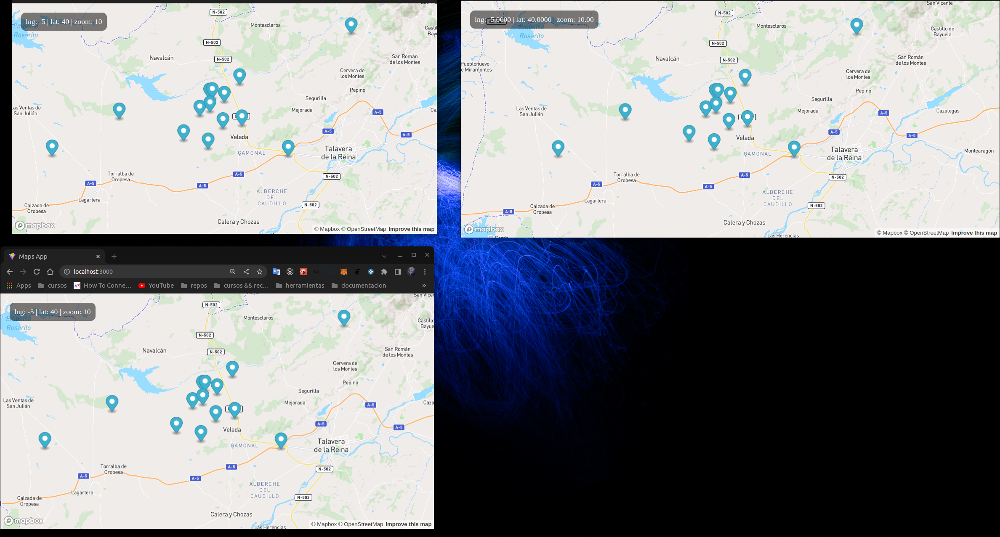

# maps-socketio

1. Rename in client-map-socket-io example.env to .env

2. Add your MapBox token in client-map-socket-io .env

- https://www.mapbox.com/

3. If you don't want to add your card in Mapbox or don't have one, you can use this tool.

- https://herramientas-online.com/generador-tarjeta-credito-cvv.php

Exec Docker

```bash
docker-compose up --build
```

App url:

- http://localhost:3000/


